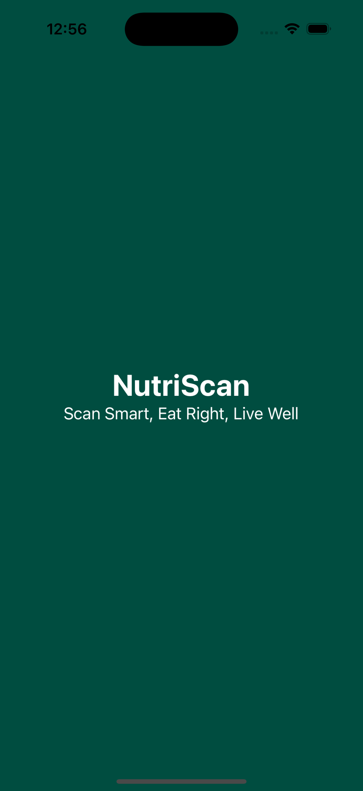
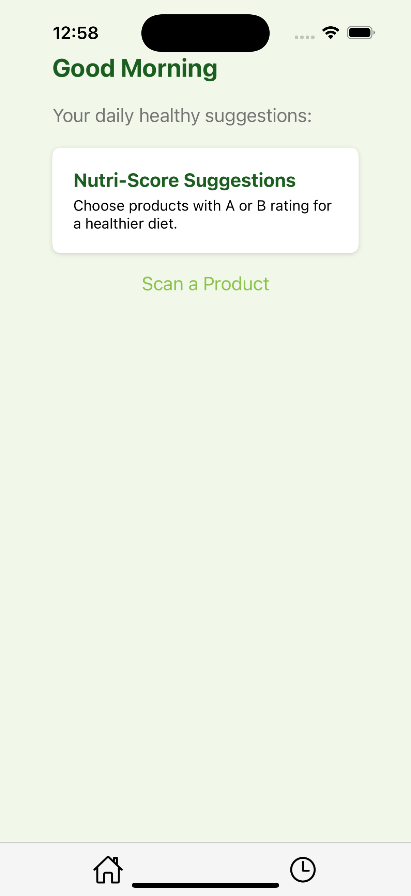

Here's the updated README with a section about the History page:

---

# NutriScan

NutriScan is a React Native mobile application that enables users to scan product ingredients and receive a food grade based on official nutritional data. Built with Expo, the app provides a smooth and intuitive user experience with features such as ingredient scanning, food grading retrieval, result display, and a history page to keep track of previous scans.

## Features

- **Scan Ingredients**: Use the device's camera to scan product ingredients.
- **Food Grade Analysis**: Analyze ingredients and receive a food grade based on nutritional content.
- **Intuitive UI**: View food grades and ingredient analysis in an easy-to-understand interface.
- **History Page**: Access a history of past scans to easily review previous products.
- **Cross-Platform Compatibility**: Built with Expo and React Native, NutriScan runs on both iOS and Android.

## Screenshots

| Splash Screen                                    | Scan Ingredients                               |
|--------------------------------------------------|------------------------------------------------|
|  |  |


## Tech Stack

- **Frontend**: React Native (Expo for development)
- **Backend**: Currently none; integrated with local APIs for food grading
- **APIs**: [Open Food Facts API](https://world.openfoodfacts.org/data) for accessing food data and ingredient analysis

### Libraries

- **Expo CLI**: Used for development and cross-platform compatibility
- **React Navigation**: Provides navigation between screens
- **React Native Camera**: Allows the device camera to be used for ingredient scanning
- **Open Food Facts API**: Fetches nutritional data and calculates food grade analysis

## Requirements

- **Node.js**: v14.x.x or higher
- **npm**: v6.x.x or higher
- **Expo CLI**: v5.x.x or higher
- **Device Requirements**: Android or iOS device with [Expo Go](https://expo.dev/client) installed

## Setup and Installation

1. Clone the repository:
   ```bash
   git clone https://github.com/AD1t12407/NutriScan.git
   ```
2. Install dependencies:
   ```bash
   cd NutriScan
   npm install
   ```
3. Start the Expo development server:
   ```bash
    npx expo start -c
   ```
   type - i for ios
   or scan the QR using Expo Go
4. Scan the QR code displayed in the terminal with Expo Go on your device to launch the app.


